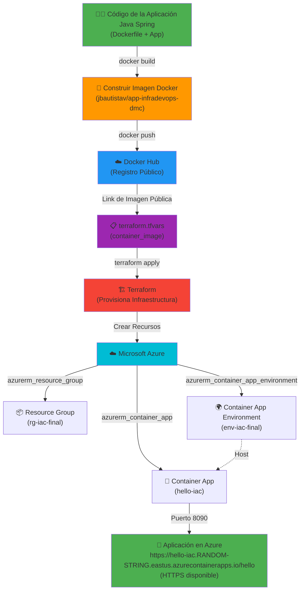

# DMC InfraTerraform

Diploma DevOps 2026 - TRABAJO FINAL Gestión de Infraestructura para DevOps

Proyecto de Infraestructura como Código (IaC) para desplegar una aplicación en Azure Container Apps usando Terraform.

## Flujo de Despliegue



## Requisitos Previos

- Terraform instalado (v1.0+)
- Azure CLI instalado
- Cuenta de Azure activa
- Docker (para construir y enviar imágenes)

## Configuración Inicial

### 1. Autenticarse en Azure

```powershell
az login
```

### 2. Actualizar el Subscription ID

Edita el archivo `terraform.tfvars` y reemplaza el `subscription_id` con tu suscripción de Azure:

```terraform
subscription_id = "TU_SUBSCRIPTION_ID"
```

Para obtener tu subscription ID:

```powershell
az account show --query id -o tsv
```

### 3. Configurar variables (opcional)

Ajusta otros parámetros en `terraform.tfvars` según sea necesario:

```terraform
location              = "eastus"                              # Región de Azure
resource_group_name   = "rg-iac-final"                       # Nombre del Resource Group
container_env_name    = "env-iac-final"                      # Nombre del Container App Environment
container_app_name    = "hello-iac"                          # Nombre de la aplicación
container_image       = "jbautistav/app-infradevops-dmc:latest"  # Imagen Docker
subscription_id       = "TU_SUBSCRIPTION_ID"                 # Tu Subscription ID
```

## Registrar Microsoft.App Namespace

Antes de ejecutar Terraform, registra el namespace `Microsoft.App` en tu suscripción:

```powershell
az provider register --namespace Microsoft.App
```

Espera a que el registro se complete (puede tomar unos minutos):

```powershell
az provider show --namespace Microsoft.App --query registrationState
```

## Ejecutar Terraform

### 1. Inicializar Terraform

```powershell
terraform init
```

### 2. Validar la configuración

```powershell
terraform validate
```

### 3. Revisar el plan

```powershell
terraform plan
```

### 4. Aplicar la configuración

```powershell
terraform apply
```

Escribe `yes` cuando se te pida confirmación.

## Acceder a la Aplicación

Una vez desplegada, obtén el FQDN (URL) de tu aplicación:

```powershell
terraform output
```

O consulta directamente en Azure Portal:
- Resource Group: `rg-iac-final`
- Container App: `hello-iac`
- La URL estará disponible en la sección "Ingress"

Accede a: `https://hello-iac.<RANDOM-STRING>.eastus.azurecontainerapps.io/hello`

## Estructura del Proyecto


```
.
├── provider.tf              # Configuración del provider de Azure
├── resource_group.tf        # Definición del Resource Group
├── container_app_env.tf     # Definición del Container App Environment y App
├── variables.tf             # Variables de entrada
├── terraform.tfvars         # Valores de las variables
├── terraform.tfstate        # Estado de Terraform (NO commitear)
└── .gitignore              # Archivos a ignorar en Git
```

## Limpiar Recursos

Para eliminar todos los recursos creados:

```powershell
terraform destroy
```

Escribe `yes` para confirmar.

## Puertos

- **Puerto Interno**: 8090 (donde escucha la aplicación dentro del contenedor)
- **Puerto Externo**: HTTPS 443 (Azure Container Apps maneja automáticamente)

## Autor

Jose Bautista 2026
